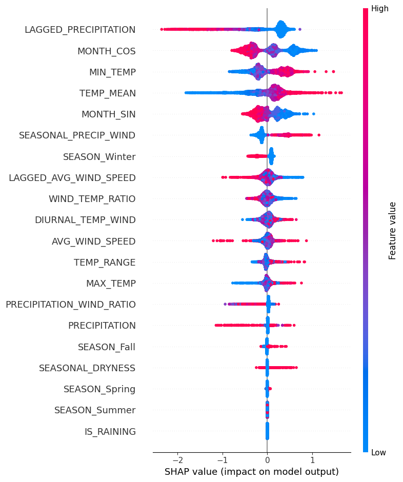
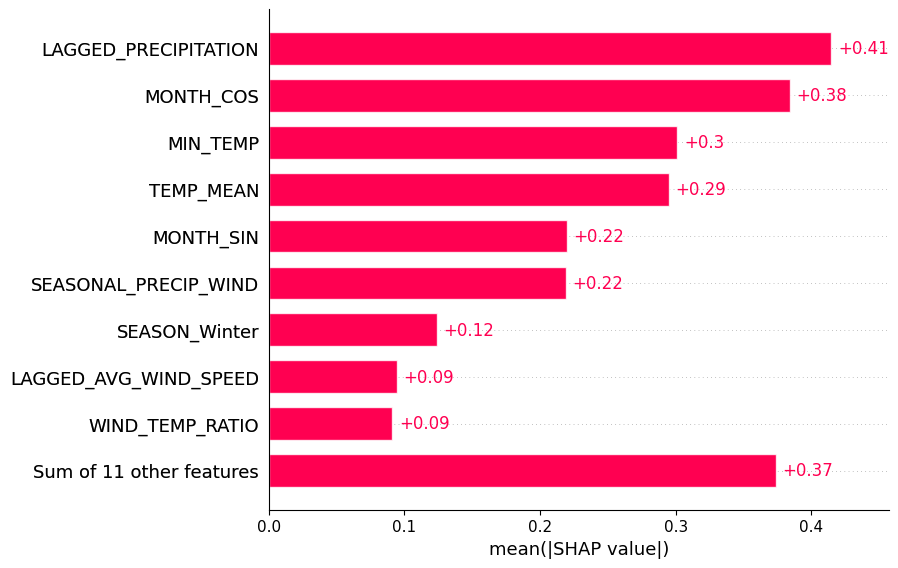
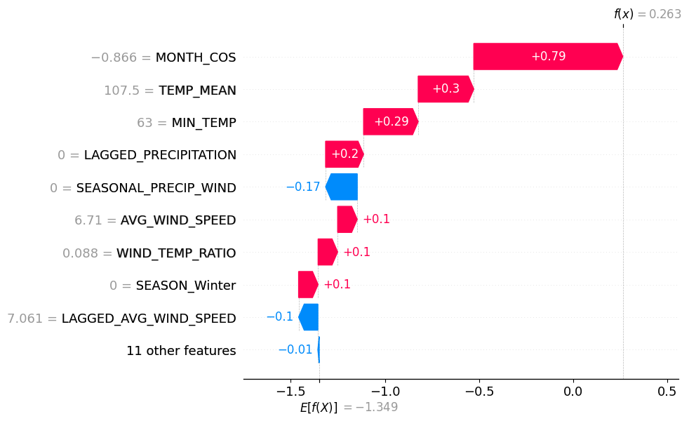
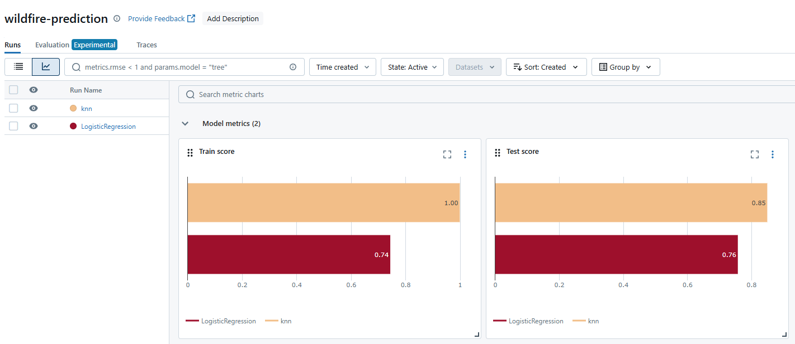
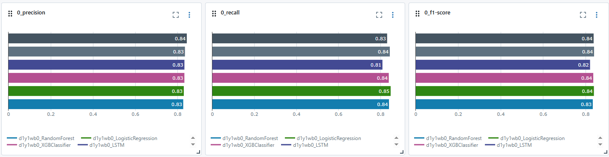
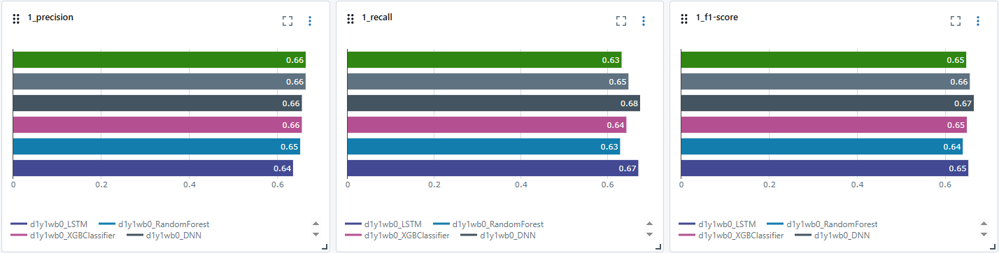
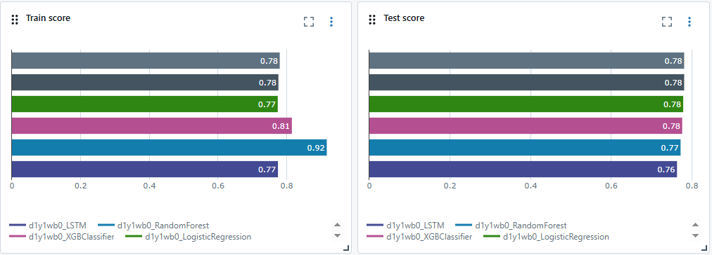

# 🔥利用歷史天氣與野火數據預測南加州火災風險🔥

## ❓ 問題陳述
2024年9月初，美國加州和內華達州因持續高溫和乾燥天氣爆發多起野火。最具代表性的是南加州的幾場野火，包括在洛杉磯東部和聖伯納地諾國家森林的火災，這些火災迅速蔓延，我們能否利用歷史天氣和野火數據來預測火災發生的可能性？

## 📦 樣品詳情

[California Weather and Fire Prediction Dataset (1984–2025) with Engineered Features](https://zenodo.org/records/14712845)  
- 1984 年至 2025 年期間
- 對同一月和同一年內不同地點發生共`14987`起火災實例進行多重索引
- 我們合併的資料集中發生了 `5096` 起火災
- `9891` 筆記錄無火災發生紀錄

## 📊 數據詳情 

### Data Dictionary:
| 欄位名稱               | 說明                                                                 |
|------------------------|----------------------------------------------------------------------|
| PRECIPITATION          | 每日降水量（英吋）                                                   |
| MAX_TEMP               | 每日最高氣溫（華氏）                                                 |
| MIN_TEMP               | 每日最低氣溫（華氏）                                                 |
| AVG_WIND_SPEED         | 每日平均風速（英里/小時）                                           |
| FIRE_START_DAY         | 是否於該日發生野火（布林值：True/False）                            |
| TEMP_RANGE             | 當日最高與最低溫差，反映氣溫變化程度                                |
| WIND_TEMP_RATIO        | 平均風速與最高溫度的比值，捕捉風與溫度間的動態關係                  |
| MONTH_SIN              | 對月份做 sin 轉換  保留了數值間的連續性與週期性               |
| MONTH_COS              | 對月份做 cos 轉換  保留了數值間的連續性與週期性               |
| SEASON                 | 季節（Winter, Spring, Summer, Fall）                                |
| LAGGED_PRECIPITATION   | 前 7 天的累積降水量，反映近一週的濕潤條件                            |
| LAGGED_AVG_WIND_SPEED  | 前 7 天的平均風速，反映持續的風力狀況                                |
| IS_RAINING             | 當日是否降雨                                  |
| TEMP_MEAN              | 溫度平均值= (MAX_TEMP+MIN_TEMP)/2                                  |
| PRECIPITATION_WIND_RATIO | 衡量降水量與風速之間的關聯。當降水量低且風速高時，通常意味著乾燥條件與強風並存，火災風險上升。|
| SEASONAL_PRECIP_WIND | 綜合考量季節（SEASON）對降水與風速影響的指標。不同季節降水和風速的組合，會對火災風險產生不同作用。|
| SEASONAL_DRYNESS        | 根據當季（秋季或冬季）的降水量與日溫差來評估乾燥程度      |
| DIURNAL_TEMP_WIND       | 此指標將每日的氣溫差（即日間溫度變化）與風速結合，評估乾燥和高風速的條件下，火災風險的潛在性。  |
| SEASON_Fall                | SEASON 做dummies                                     |
| SEASON_Spring              | SEASON 做dummies                                      |
| SEASON_Summer               | SEASON 做dummies                                     |
| SEASON_Winter             | SEASON 做dummies                                      |
|------------------------|----------------------------------------------------------------------|
### 根據[NOAA](https://www.noaa.gov/noaa-wildfire)和[Climate](https://www.climate.gov/news-features/event-tracker/weather-and-climate-influences-january-2025-fires-around-los-angeles)增加指標`PRECIPITATION_WIND_RATIO`、`SEASONAL_PRECIP_WIND`、`SEASONAL_DRYNESS`、`DIURNAL_TEMP_WIND`

## 📈 各項指標重要程度 

## 🧠 多種模型架構的比較與選擇策略

本專案整合了多種常見的分類模型，以達到更穩定、全面的預測能力。透過實作與比較不同演算法的行為與表現，有助於開發者根據資料特性與實際需求做出最佳選擇。

---

### 🔍 為什麼使用多模型？

- 不同模型對資料的假設與敏感度不同，有助於探索資料中的潛在模式。
- 可對齊真實業務需求進行調整（如解釋性 vs. 準確率）。
- 有助於後續進行集成學習（Ensemble Learning）或 AutoML 選模流程。

---

### 🎯 如何管理這些模型？

- 本專案採用 [MLflow](https://mlflow.org/) 作為機器學習與深度學習模型的實驗追蹤與管理工具。
- MLflow 是一個開源平台，支援完整的機器學習生命週期（ML lifecycle），涵蓋從實驗記錄、模型訓練、版本控管到部署的各個階段，能有效提升專案的可重現性與開發效率。
- **Tracking**：記錄每次實驗的參數（parameters）、評估指標（metrics）、模型產出（artifacts）與原始碼版本，便於實驗管理與結果比較。
- **Projects**：透過 `MLproject` 檔案標準化專案格式，支援使用 Conda 或 Docker 定義可重現的運行環境。
- **Models**：以統一格式（如 Python Function、ONNX、TorchScript）封裝模型，支援多種部署方式，例如本地部署、REST API 或雲端服務。
- **Model Registry**：集中管理模型的版本與階段狀態（如 Staging、Production），便於協作與與 CI/CD 整合。

- **[我的mlflow環境](https://github.com/yehdanny/MLflow_)**
---

### 📘 模型介紹

- 使用 
  - 羅吉斯回歸（Logistic Regression）
  - K 最近鄰（KNN）
  - 隨機森林（Random Forest）
  - 深度神經網路（DNN）
  - 注意力機制（Attention Mechanism）
  - LSTM  (Long Short-Term Memory)

---

### 🧭 選擇模型策略

- 初期探索：可用 Logistic Regression 作為 baseline。
- 精度優先：優先考慮 Random Forest 或深度模型。
- 解釋性要求高：採用可視化特徵權重的模型，如 RF、Logistic。
- 有時序或結構性輸入：採用 Attention 或 LSTM 變體。

---
### 🔥 模型比較 

---
## 🧪 各指標圖簡要說明

### ✅ 類別 0（多數類別）

- 0_precision：模型預測為 0 時，多數是對的（Precision 約 0.83–0.85）。
  - DNN 、 Attention 、 LSTM 分別佔據前三名

- 0_recall：模型幾乎能找出所有類別 0 樣本（Recall 約 0.84）。

- 0_f1-score：大部分模型都能良好處理主類別，F1 分數高達 0.85。

### ⚠️ 類別 1（少數類別）

- 1_precision：XGBoost 高達 0.80，準確挑出正樣本。

- 1_recall：各模型召回率約 0.63–0.68，辨識能力有限。

- 1_f1-score：表現較差，最高僅約 0.67。

### 📈 模型整體表現

- Train score：訓練正確率落差大（0.77–0.92），Random Forest 過高，可能過擬合。
- 
- Test score：測試正確率約 0.76–0.78，Attention、DNN 表現最好最穩。

### 🧾 結論總結

<h5>

在本專案中，我們整合了多種天氣與季節性特徵，並嘗試以六種模型來預測南加州地區的火災風險。即使在已進行 `class weight balance`、`early stopping` 以及 `learning rate schedule` 等優化策略下，模型對於少數類別（即「發生火災」）的預測準確度仍顯有限，整體 `F1-score` 僅落在 `0.66–0.68` 區間，凸顯了少數類別預測的挑戰性。
 

特別值得注意的是，`Random Forest` 和 `XGBoost` 在透過 `RandomizedSearchCV` 調參後，仍能達到約 `0.85` 的訓練準確率，顯示這類基於樹的模型在處理 `tabular` 結構數據時的穩健性與解釋性。然而，隨之而來的是過擬合風險，特別是 `Random Forest`，其訓練與測試分數差距較大。
 

另一方面，深度學習模型如 `DNN` 與 `Attention` 雖在少數類別的 `precision` 與 `recall` 略遜，但在測試資料上的整體表現最穩定，且具有潛力進一步透過時間序列特徵強化（例加入去年冬季的天氣趨勢）來提升辨識力。

**LSTM 效果不如預期**  
相比` Logistic Regression` 或 `Random Forest``，LSTM` 屬於高參數模型，在樣本數相對有限（約 1.5 萬筆）下可能產生過擬合風險，即使有 early stopping 機制，也不易取得穩定表現。

</h5>
總結而言：

- 類別不平衡仍是目前預測效能的主要瓶頸。

- 在強風乾燥季節，具備物理意義的工程特徵如 `SEASONAL_DRYNESS` 及 `DIURNAL_TEMP_WIND` 有助於提升模型可解釋性。

- 若要進一步強化「火災發生」的辨識，可考慮引入：

  - SMOTE 或 ADASYN 等資料合成技術處理不平衡。

  - 時間序列建模（如 Transformer、BiLSTM） 捕捉週期性與趨勢。

  - 蒐集更多實地監控資料（如地表濕度、植被乾燥度）。

**本研究也展示了 `MLflow` 在實驗與模型管理上的效率與清晰度，為後續部署與調整奠定良好基礎。**