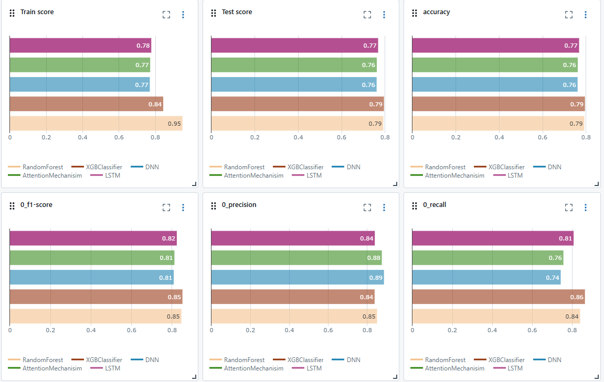

# 🔥利用歷史天氣與野火數據預測南加州火災風險🔥

## ❓ 問題陳述
2024年9月初，美國加州和內華達州因持續高溫和乾燥天氣爆發多起野火。最具代表性的是南加州的幾場野火，包括在洛杉磯東部和聖伯納地諾國家森林的火災，這些火災迅速蔓延，我們能否利用歷史天氣和野火數據來預測火災發生的可能性？

## 📦 樣品詳情

[California Weather and Fire Prediction Dataset (1984–2025) with Engineered Features](https://zenodo.org/records/14712845)  
- 1984 年至 2025 年期間
- 對同一月和同一年內不同地點發生的多起火災實例進行多重索引
- 我們合併的資料集中發生了 4,279 起火災
- 6,709 筆記錄無火災發生紀錄

## 📊 數據詳情 

### Data Dictionary:
|Feature|Type|Description|
|---|---|---|
|**date**|*object*|The month and year of when the fire took place.|
|**county**|*object*|The county the fire started in.|
|**maxtempF**|*float*|The average maximum temperature of that month in °F.|
|**mintempF**|*float*|The average min temperature of that month in °F.|
|**avgtempF**|*float*|The average average temperature of that month in °F.|
|**totalSnow**|*float*|The total snow for that month.|
|**humid**|*float*|The average humidity for that month.|
|**wind**|*float*|The average wind for that month.|
|**precip**|*float*|The average precipitation for that month.|
|**q_avgtempF**|*float*|The quarterly average temperature in °F.|
|**q_avghumid**|*float*|The quarterly average humidity.|
|**q_sumprecip**|*float*|The quarterly average precipitation.|
|**sunHour**|*float*|The average hours of sun for that month.|
|**FIRE_NAME**|*object*|The name of the fire.|
|**CAUSE**|*float*|The cause of the fire.|
|**lat**|*float*|The latitude coordinate of the fire's location.|
|**long**|*float*|The longitude coordinate of the fire's location.|
|**GIS_ACRES**|*float*|The total number of acres burned.|

## 🧠 多種模型架構的比較與選擇策略

本專案整合了多種常見的分類模型，以達到更穩定、全面的預測能力。透過實作與比較不同演算法的行為與表現，有助於開發者根據資料特性與實際需求做出最佳選擇。

---

### 🔍 為什麼使用多模型？

- 不同模型對資料的假設與敏感度不同，有助於探索資料中的潛在模式。
- 可對齊真實業務需求進行調整（如解釋性 vs. 準確率）。
- 有助於後續進行集成學習（Ensemble Learning）或 AutoML 選模流程。

---

### 📘 模型介紹與應用情境

#### 1. 羅吉斯回歸（Logistic Regression）

- **特點**：
  - 簡潔易解釋，適合做為 baseline。
  - 對線性關係敏感。
- **適用情境**：
  - 特徵維度較低，且可接受線性假設的資料集。
  - 需要強解釋性的商業應用，如金融風險評估。
- **缺點**：
  - 難以處理非線性或高維非結構化資料。

---

#### 2. K 最近鄰（KNN）

- **特點**：
  - 非參數模型，無需訓練即可預測。
  - 須標準化特徵距離，對離群值敏感。
- **適用情境**：
  - 小型資料集。
  - 決策邊界複雜但資料分佈稠密。
- **缺點**：
  - 計算成本高（尤其在大型資料上），難以擴展。

---

#### 3. 隨機森林（Random Forest）

- **特點**：
  - 基於多棵決策樹的集成模型，具強大擬合能力與抗雜訊能力。
  - 自動進行特徵重要性排序。
- **適用情境**：
  - 異質性高、非線性資料集。
  - 需要穩健模型的應用場景，如醫療風險預測。
- **缺點**：
  - 難以解釋每個單獨決策，模型黑盒程度較高。

---

#### 4. 深度神經網路（DNN）

- **特點**：
  - 多層感知器架構，能學習高度非線性特徵。
  - 結合 Dropout 可提升泛化能力。
- **適用情境**：
  - 大型資料集、特徵關係複雜。
  - 圖像、語音、序列等深層特徵提取需求。
- **缺點**：
  - 需較多超參數調整與訓練時間，對資料需求大。

---

#### 5. 注意力機制（Attention Mechanism）

- **特點**：
  - 適合序列輸入資料（如文本、時間序列）。
  - 具備動態聚焦特徵權重的能力。
- **適用情境**：
  - 資料存在時序性、上下文依賴性。
  - 如聊天機器人、交易行為預測。
- **缺點**：
  - 架構複雜，需更多訓練資源與資料前處理。

---

### 🎯 為何整合這些模型？

- **模型互補性**：線性模型（Logistic）與樹模型（RF）、深度模型（DNN）能從不同角度學習資料。
- **效能與資源平衡**：部分模型適合快速部署，部分則提供深層學習能力，便於根據場景彈性切換。
- **探索模型邊界**：藉由多模型比較，可掌握哪些特徵組合或資料轉換方式對預測最具貢獻。

---

### 🧭 選模建議策略

- 初期探索：可用 Logistic Regression 作為 baseline。
- 精度優先：優先考慮 Random Forest 或深度模型。
- 解釋性要求高：採用可視化特徵權重的模型，如 RF、Logistic。
- 有時序或結構性輸入：採用 Attention 或 LSTM 變體。

---
### 🔥 模型比較 

